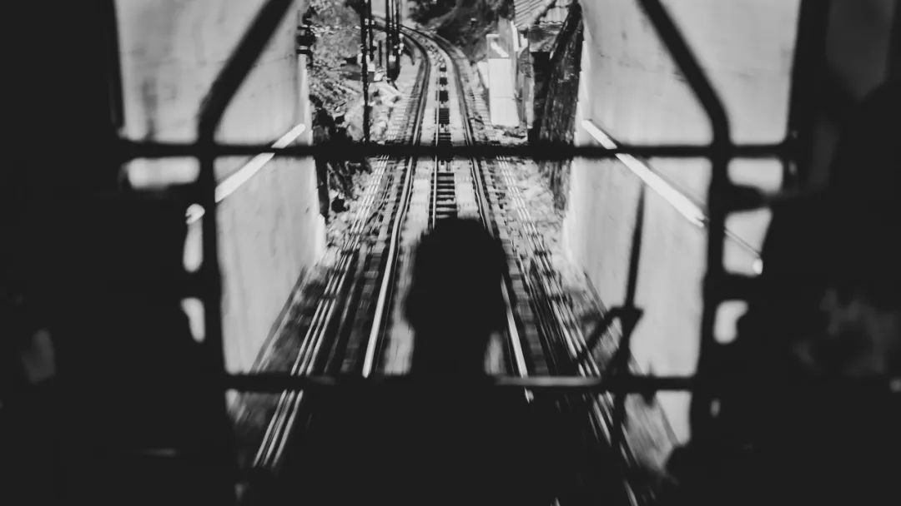

# 周公子造成的内耗，二舅解决不了

https://mp.weixin.qq.com/s/MI9axLtR6IA4mnNMDWIVJw#

这段时间发生的那两件事，想写一篇长文来着，可是琐碎的观点又连不在一起，干脆，用这种碎片形式发出来吧。

1、“内耗”的本质是理想和现实的不统一，“能得到的”和“想得到的”不一致，并且不确定自己能不能得到，精神上饱受煎熬。啥时候知道了自己反正也得不到想得到的，也就不内耗了，踏踏实实过好眼前的生活。这个意义上讲，谁都治不好谁的精神内耗。

2、 四十不惑，意思是绝大部分人到了四十就彻底认命了，不再纠结得不到的，别人可能觉得你豁达或者“活明白了”，只有你自己觉得自己这辈子也就这样了，只能是把现在的日子过下去，不然还能咋的。

3、励志文学随着经济增速放缓已经基本穷途末路了，今后的趋势是“赏惨”，我一朋友心态不好就去icu外坐着等媳妇，他老婆在那里工作，他在icu外的见闻发朋友圈能凑出来一本“icu文学”，每次看完我都有点觉得自己那点麻烦不算啥，心态能好很多。

3.1、日本曾经也发生过这种转换，战后曾经有三十年是日本的“鸡血时代”，那时候大家也相互激励，励志文学以“走出舒适区”，“去东京打拼”，“去大藏省爬天梯”为主，泡沫破灭后经济大幅放缓，很多人发现走出舒适区也得不到啥，白白承受痛苦，还不如在舒适区躺着，逃避固然可耻，可是它舒服啊。与此同时，去物语，反消费主义，断舍离等思潮开始崛起，电视和文学节目越来越丧，社会观念也从鼓励奋斗转向了“只有浪费掉的时光才是自己的”之类的颓废观念，一直持续到现在。

4、一个很惨的人如何能振奋起来？让他和更惨的人待在一起。美帝那边有那种“互助会”，一群有共同痛苦的人围成一圈，吸毒的、失去亲人的、得了重病的，分享各自的惨痛经历，据说有助于身心健康。

 

5、人的一生，是一个“加buff”的过程，家境好，脑子好，父母开明，生在中国而不是叙利亚，都是正向buff。我二爹跟那个二舅很类似，他脑子很好，生了个儿子考上了浙大，可他一辈子在村里种地磨豆腐，主要原因是出生在了60年代山西北部最穷的村里，负向buff加满，几乎寸步难行。不过他早就不内耗了，知道自己啥都改变不了。那个二舅也是负向buff加满的人，左突右突最后生存空间越来越窄。

5.1、我二爹表示他一生做得最对的事，就是没瞎掺和自己儿子的事，因为他知道，自己无论怎么想都是错的，既没有相关见识，也没有相关经验，既然儿子比自己强，就该让儿子自己去选择。

5.2、张朝阳说，年轻人不要太努力。可能是因为他意识到，“努力”只是其中一个buff，其他buff太好不需要太努力，其他buff不行努力也没用，不如放松点。当然了，可能他强调的是“太”，读者们看到的是“努力”。

5.3、我弟在杭州毕业后赶紧落户买房永久定居了，他管这个叫“老鼠搬家”，因为李斯说过，出生在厕所里的老鼠瘦骨嶙峋，出生在粮仓里的老鼠脑满肠肥，老鼠的错不在于它自己没努力，只是因为它的出生点位错了。我弟认为自己就是从厕所搬到谷仓的老鼠，从几百年的穷乡僻壤搬到了几百年的富裕地区，负向buff少一个算一个。

6、周·社会观察家·劼：

**“高中同学不少去外省读了好大学的，都回家进了烟草、电网之类的，回家没有着落的，就在北上广深成都”。**

不得不说，这个观察非常有道理，我很早就在文章里提到过类似的观点，中国推动城市化最大的助力，就是几亿退无可退的年轻人，他们是做题家，还有大量的做题能力很差的做题家，前者去格子间，后者去工地，他们有回不去的故乡和追不到的梦，所以一辈子都得跑，没法停下来。

6.1、他还说：

**“我怕你会读书吗，名校研究生都别想那么容易进我单位。这个人当年仗着自己会读书，看不起我们这种靠父母的，社会会教他做人”**

这话最可怕的地方就在于他说的没啥错，学习只是其中一个buff，父母又是另一个，而且周公子除了父母，还有大伯二伯，大家一起发力，确保他能在体制内谋个肥差，如果这种状态没人管，阶级固化什么的，就在不远的将来。

6.2、周公子最大的问题，就是反向“比惨”，让不少人意识到门阀竟然在基层复活了，三本都可以进国资。不少人看完《二舅》产生了一种内心宁静感，很快就被周公子给搞没了。忍不住思考着两者之间是不是有什么联系，二舅那么惨，仅仅是个人原因？还有没有改善空间？而且好像谁都在村里有那么一个二舅。

7、周公子这事，让人有种非常不好的感受，周公子自己显然不是什么大角色，但是他们家显然是一个大网，一个盘踞在基层的利益共同体，他们家每个人都不是大官，但确实是一个不断“自我加强”的组织，通过血缘纽带链接在一起，几十个这种家族，很可能就能垄断基层所有肥差。让人不由得觉得 ，当初用了无数人的生命，才打倒的鹅城黄家，如今正在悄悄复辟，正在基层形成一个个封闭的小圈子，周劼这种人并不可怕，可怕的是那些权势门路比他大，嘴却比他严的人。封闭导致近亲繁殖，近亲繁殖导致畸形。

8、胡锡进说，“在公平建设的方面，中国仍任重道远，但大趋势大方向是积极的，就是我们的社会在朝越来越公平前进，而非朝着越来越不公平后退”，这个说法我是认同的，一方面是党在十八大之后从严治党，但是我觉得更重要的是，老百姓的观念正在觉醒，越来越不能容忍特权和门阀。

9、越来越多的人有了反思能力，思考和解构那些我们以前觉得天经地义的事到底对不对，不是单纯赞美苦难，而是去思考苦难背后的原因。

10、这个世界短期是少数人决定的，长期是大部分人的观念决定的。教育的普及和经济的发展，让这种趋势几乎不可逆。《乌合之众》里有句话说得很对，**数量，即正义**。古代为啥能接受“家天下”，为啥能接受大清那样的种姓制？本质还是大部分人觉得那种状态是合理的，那种状态自然有了合法性，汉族官僚掌握军权后依旧自发维护那种体制，本质也是这种共识在作怪。如果大家不再觉得特权是合理的，特权的生存空间也就越来越小。

11、所以我对这个国家依旧充满信心，原因也是我上文说的，我们有勤劳勇敢的人民，有为的执政党，还有不断普及的教育和一直向前的经济。为啥今年破事这么多，我不觉得是这个世界变坏了，而是大家的底线越来越高，底线升一寸，这个社会上不合理的事就多一堆，如果底线足够低，那社会上可能没啥坏事了。很多问题只要放到明面上来讨论，只要不回避问题，已经解决了一半。