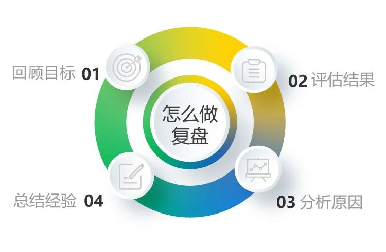

# 完整的复盘具体应该怎么做（工作复盘的正确方法和步骤）

每一年的年前年后都是进行下一财年规划的时间段，作为启动新规划工作的前奏，大部分企业都会对今年战略的执行情况进行复盘，所以，每年的这个时候，辅导和帮助我们投资的企业对经营、管理进行复盘，进而落地复盘方法，促进形成复盘文化，是我们增值服务中做复盘辅导量最大的时间段。

“主要是产品性能和质量问题”、“是因为研发变化太快，生产这边根本没办法那么短就都调整好”、“销售总是跟客户吹牛，造成售后压力巨大”、“我认为是公司战略出了问题才导致的库存积压”、“说到底还是我们的销售能力不行”……

这是面对没有完成的业绩时，经常听到的各个部门负责人在复盘时给出的理由，争吵严重的甚至导致复盘讨论无法继续进行下去。也见过“顺利”的复盘讨论会，比如有的企业在年终复盘时，每块业务和职能的负责人一个一个顺次讲自己写的复盘报告，其他人均无异议，复盘会就这样顺利开完了，走完这个“过场”，大家也都松了一口气，觉得完成了一项规定动作。“奥，原来我们自己的复盘是没有做到位的”，几乎是每次我们辅导后CEO都会发出的感叹，那么，怎么让复盘更有效呢？

相信大家对复盘的四步骤已经很熟悉了，这里我们不展开每一个环节，我想着重谈谈影响复盘有效性的几个关键问题。

复盘的四个步骤

**1**

**复盘：让下次做得更好**

为什么要复盘？简单地说就是为了“让下次比这次做得更好“。所以复盘有两个重要的导向：一是学习导向，一是行动导向。

大家都知道“复盘”是围棋术语，指每次棋局结束后，双方棋手把刚才的对局再重摆一遍，回顾对弈过程中每一次落子的位置和每一个变化的得失。这是一个动态的过程，除了自己步骤要正确之外，还取决于对方的应对。所以这样可以有效地加深对这盘棋中招法和策略的理解。这是每一位围棋手棋力增长的重要途径。

柳传志柳总曾说过复盘如何用在企业里：“一件事情做完了以后，尤其是没做成功的，坐下来把当时这个事预先怎么定的？中间出了什么问题？为什么做不到？理一遍，理一遍以后，自然这次的经验教训就吸收了，对下次做有帮助”。复盘的主要目的是为了改进行动和积累经验，是逐步提高整个团队能力的方法。不论是开展业务还是进行管理，企业的每一个动作都是有成本的，复盘能够让我们不白交“学费”，避免重复犯错。

**复盘是执行的组成部分，**复杂任务、大型项目、企业战略，在执行的过程中都需加入“阶段性复盘”的动作，及时发现问题并做出相应调整或明确“继续”，这对于组织在执行中不断的统一思想和协调步调，保证整体目标的实现，都是非常必要的。

**复盘也是在实践过程中培养人的有效方法。**学习成长的70/20/10法则告诉我们，70%的学习成效来自于亲身体验，复盘可以让经历更有效地转化为知识和能力，复盘的这个动作本身也是对人的一种训练和培养。那些善于复盘的企业，不仅执行力强，还能不断地总结出经验和方法，员工也通过复盘不断提高认知水平和执行能力，成长更快、更扎实。

明确复盘是以学习和改进为目的至关重要，这个导向才能让复盘的参与者做到基于事实进行分析、反思，得出利于下次做得更好的经验或启示。如果把复盘导向成“定责”，甚至简单地与绩效考核挂钩，则很快就会使复盘陷入文过饰非、推诿抱怨、批评指责的泥沼中，不但成败的真实原因没法找到，这样得出的复盘结果对未来的指导意义也会大打折扣。所以，如果要让复盘达到使人们提高的效果，在企业里形成积极的复盘文化，让员工都能自觉自愿地进行复盘，就要坚持复盘的学习和行动导向，引导求实、开放的心态，避免把复盘与考核等同起来。

**2**

**要透过目标回顾目的**

“回顾目标”是复盘的第一个环节，很多人在做复盘的时候一上来就把当初定的目标拿出来，紧接着就用各项执行结果与最初定的目标进行对照，然后就进入了分析环节。这似乎是符合复盘流程的操作，但它忽略了对目标本身的复盘，和对目标“是否统一了认识？”的复盘，这两点对于提升团队确定目标的能力和执行动力非常有帮助。

首先，对目标本身的复盘，不仅要看目标是什么，更要看当初定这个目标的目的是什么，其中包含了确定这个目标的原因、过程以及实现目标的路径。目的不是目标本身，比如，某企业制定了一个全年营业额的“目标”，其“目的”是使成长速度、市场占有率、行业影响力等综合实力达到某种程度。**复盘时，不仅要回顾当初确定的目标是什么，更要回顾当初为什么要确定这样的目标，这个目标达成对组织意味着什么，实现这个目标的策略是什么，**这个过程是对目标的确定逻辑和重要意义的再次回顾、确认，检视确定目标的方法是否正确、目标本身是否合适。

**其次，是对目标是否“统一认识”了的复盘，要看看团队当初对这些“为什么”有没有共识，为了达成共识，是否做了必要的沟通、宣贯工作。**有的人直到事后复盘时都不知道“为什么”要做，这样的情况还不在少数。我们在辅导企业做复盘的时候，经常会遇到业务负责人说不清“为什么”的情况，或者他们所认为的“为什么”与公司确定这一目标的出发点不一样。不知道“意义”，工作起来就缺乏动力，如果管理者自己都说不清楚“为什么”，他本身的动力以及他的号召力和感染力也不足以影响到更多的人，会直接导致团队的执行动力不足。

大家不仅了解“为什么”，还有高度共识，才有可能达到组织所渴望的“万众一心”，这种决心在战略推进中将产生巨大力量，特别是在遇到困难和变化时，团队会展现出解决问题、战胜困难的决心和智慧，这种“人人都是发动机”的内在动力，就是企业战略推进中必要的整体决心力。

所以，在“回顾目标”环节，要共同回顾目标是什么、为什么，以及大家知不知道为什么，来检视我们在确定目标过程中，是不是强调了实现目标的重要意义，是不是为了让大家理解和认同目的、目标而做了必要的工作。

**3**

**不能缺少“回顾过程”**

我们最初总结的复盘流程是“目标回顾”、“结果是什么”、“过程是怎么做的”、“原因分析”、“经验教训”、“可固化的做法”六个环节，为了便于推广，经过讨论简化为“回顾目标”、“评估结果”、“分析原因”、“总结经验”四个环节，将“回顾过程”归在了“分析原因”中。

任何一件事情结束后，如果只拿结果与目标的差异来进行分析，不看过程中发生了什么事情、又是怎么分析和应对的，而把目标没达成简单归因于外部环境发生了变化，则组织很难改进，毕竟外部环境的变化是无法控制的，那就只按当初的规划做，其他情况都“听天由命”了？应对变化是组织和个人都必须具备的能力，所以，不仅要复盘计划内的执行动作是否做到位，还要复盘组织应对变化的能力，要通过过程的回顾，找找还有没有能够做得更好的改进空间，这对VUCA时代企业的战略落地更加必要。

回顾过程有利于当事人找到问题的真实原因，要回顾每一个动作及动作背后的思考，回顾过程演进的每一个关键点、回顾每一个边界条件的变化、回顾对环境变化的分析判断、回顾应对变化所采取的措施、回顾每一个关键点的结果，“原原本本地再过一遍”，真实原因才能呈现，基于真实原因的经验、教训，才更利于下一步的改进和组织的成长。“回顾过程“是复盘时必须要做的动作，是真实的基础，因此在每一次执行的时候就要给过程“留痕”，会议纪要和计划、检查等过程文档要保存好，避免复盘时“编造”过程。

**4**

**学到了什么？**

每次复盘都要得出启示，但注意不要轻易得出“规律”，规律是指事物之间内在的必然联系，它决定着事物发展的必然趋势，如果把偶然因素导致的结果视为规律，那必然是“刻舟求剑”。对于复盘获得的经验积累，要经过“剥洋葱”式的再三追问，还要看这是否是偶发因素导致的？如果有不同事件的交叉印证，那可能就具有相对普遍的指导意义了。

在分析原因和总结经验时，要特别强调的是，多从自身看什么样的改变可以做得更好。正如毛泽东在《矛盾论》中所说“外因是变化的条件，内因是变化的根据，外因通过内因而起作用”，所以，**成功时主要看客观原因，失败时主要看主观原因，学习的结果是体现在改变自我上的。**

如果每次的复盘，都能在目标设定与策略选择、方案设计与计划执行、沟通宣贯与统一认识、过程推进与资源协调、环境监控与应对变化、策略调整与风险控制等方面，对 “接下来该怎么做”和“应汲取的教训及重要的启示”进行分析总结并有所收获，复盘效果就出来了。

**5**

**谁来做复盘？**

在企业里，战略、业务、职能管理都应复盘，每一位同事都要参与所做工作的复盘，“谁做事谁复盘，谁复盘谁受益”。

复盘的目的是学习和改进，对于团队而言，这个目的不是负责人写一份报告就能达到的，最好是让做事的每一位责任人都进行复盘，让每一次复盘成为团队学习的好机会。

如果是以部门或团队为单元完成的任务，一般任务的总负责人也是复盘的总负责人，每一位参与者负责完成相应部分复盘报告的起草工作。

**第一步是形成复盘报告的“靶子稿”。**小组成员的主要任务是按照复盘的四个基本步骤写出各自负责工作的复盘报告。在起草报告时，注意对目标制定过程及执行过程的回顾，要查阅“历史”文档，尽量还原真实的过往；在分析时，客观地反映出当时的情景和真实原因，要多问“为什么”；要做相关的内外部关键人员访谈，多角度看清事实，特别要多看内部原因产生的影响，汲取经验教训；然后在小组内进行充分讨论、汇总，得出启示，形成系统梳理的复盘报告“靶子稿”。

**第二步是更大范围的分享。**扩大范围的复盘讨论会和学习他人的复盘报告，都是常见的分享形式。如果认为有必要分享给更多的人，则由再上一级或公司召开扩大范围的复盘讨论交流会，小组主讲、全员互动，大家再结合自己的经验体会发表意见、贡献智慧。这个扩大范围的复盘会，将会在小组复盘报告的基础上，激发出更多的相关经验，会后，小组将讨论中产生的重要观点整理进“靶子稿”，形成正式的复盘报告。最后，将复盘报告作为公司的知识沉淀进行保存，成为企业知识库的重要组成部分以供查阅。

我们在辅导企业做年度复盘时，当各个部分的复盘报告完成后（是经过部门内讨论的），在最后的全体干部复盘讨论会上，一般会选主要业务单元和人力资源及财务两大职能在会上分享和讨论。先由各块负责人讲自己的复盘报告，其他人可以提出问题、发表感想，这中间，CEO往往是不断提问引导探寻“真相”，并能够承担责任的人。不同的理由、不同的观点直接碰撞，直逼“问题究竟是什么”，这个环节是最有挑战的，而最终得到的改进措施、注意事项和启示，也是最有指导意义和可落地的。

https://www.yifou.com/p/18306.html